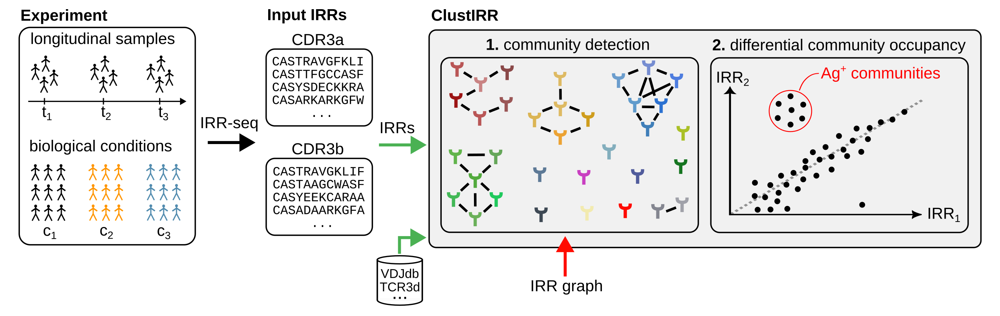

```{r setup, include = FALSE}
knitr::opts_chunk$set(collapse = TRUE,
                      comment = "#>",
                      fig.height = 5,
                      fig.width = 5,
                      fig.align = "center")
```


```{r}
library(ClustIRR)
library(knitr)
```


# Introduction
To protect the host against genetically diverse and rapidly evolving pathogens, 
adaptive immunity relies on diverse repertoires of immune receptors (IRs), which
includes B- and T-cell receptors (BCRs and TCRs). TCRs recognize peptide:MHC 
complexes, whereas BCRs bind directly to antigens. Antigen recognition may lead 
to immune cell activation. In such a case, the immune cells start to proliferate
rapidly, forming clones of antigen-specific cells capable of mounting effective 
immune response. Hence, decoding the relationship between IRs and antigens is 
essential for developing cancer immunotherapies, vaccines, and antiviral drugs. 

Owing to the advances in high-throughput sequencing technology, it is now 
possible to sequence entire repertoires of IRs. By performing clustering of 
the IR sequences, we can identify clusters of IRs with similar specificity.

This vignette introduces `r Biocpkg("ClustIRR")`, a computational method 
for clustering of immune receptor repertoires.


# ClustIRR algorithm
The algorithm of `r Biocpkg("ClustIRR")` performs clustering of IR sequences 
to find groups of IRs with similar specificity. 

```{r graphic, echo = FALSE, fig.align="left", out.width='90%'}

```


# Input

The main input of ClustIRR are two sets of amino acid sequences of the 
complementarity determining region 3 (CDR3). The CDR3s may come from one T 
cell receptor chain (e.g.\ only CDR3$\alpha$s or only CDR3$\beta$s) or from 
both chains (CDR3$\alpha\beta$). The two sets represent two repertoires:
    
  * `s` : IR repertoire to be analyzed (case sample)
  * `r`: reference IR repertoire (control/reference sample)

**Hint:** `s` and `r` may also consists of CDR3s from $\gamma\delta$ T-cells 
($CDR3\gamma$ and CDR3$\delta$) or B-cells (CDR3H and CDR3L).

Lets look at an example data, which we will use as input:

```{r}
data("CDR3ab")
```

```{r}
# take the first 500 sequences from the data -> s
s <- CDR3ab[1:500,]
s$CDR3a <- NULL

# take 5000 sequences 501:5500 from the data -> r
r <- CDR3ab[501:5500,]
r$CDR3a <- NULL
```


```{r}
str(s)
```


```{r}
str(r)
```


# Clustering

`r Biocpkg("ClustIRR")` employs two clustering strategies:

  * **local** clustering: detects enrichment of motifs in the data sample 
    compared to the reference
  * **global** clustering: identifies pairs of CDR3s that have similar
    sequences

The rationale behind these two clustering strategies is the following: two 
identical CDR3 sequences have the same specificity. CDR3 sequences that are
similar (e.g. share the same sequence but differ at only 1 position) likely 
have similar specificity. Global clustering is designed to find such global 
pairs. 

Two CDR3s with significantly different sequences may still recognize the same
peptide if they share a motif in their cores regions (e.g. identical 4-mer ). 
Such "useful" motifs may be enriched in the sample but not in the reference 
repertoire, and the purpose of local clustering is to identify them.


## Local clustering

CDR3 sequences are segmented into overlapping **motifs** ($k$-mers), where $k$ 
is specified by setting the input $ks = 4$. 

Example of segmenting CDR3 sequence into 4-mers:

```{r}
cdr3 <- "CASSTTTGTGELFF"
k <- 4
colnames(stringdist::qgrams(cdr3, q = k))
```


$k$-mers found in the core region of the CDR3 loop are more likely to establish 
contact with the antigenic peptide than the $k$-mers found at the flanks of the 
CDR3 sequence. Hence, the user is encouraged to remove few amino acids from the 
flanks of each CDR3 sequence by setting e.g. `control$trim_flank_aa = 3`.

Example of trimming CDR3 flans and segmenting the core of the CDR3 sequence 
into 4-mers:

```{r}
t <- 3
cdr3_trimmed <- substr(x = cdr3, start = t+1, stop = nchar(cdr3)-t)
colnames(stringdist::qgrams(cdr3_trimmed, q = k))
```
 

A motif is enriched if it satisfies the the following criteria:

  1. `control$local_min_o`: minimum motif frequency in `s`
  2. `control$local_min_ove`: minimum ratio of observed vs. expected (OvE) 
    relative motif frequency, with $OvE=\dfrac{f_s}{n_s}/\dfrac{f_r}{n_r}$
    
      * $f_{s}$ and $f_{r}$: motif frequencies in repertoires `s` and `r`
      * $n_{s}$ and $n_{r}$: total number of motifs in repertoires `s` and `r`
      
  3. `control$local_max_fdr`: maximum false discovery rate (FDR) corrected 
    p-value computed by Fisher's exact test


## Global clustering

For global clustering ClustIRR quantifies the difference between pairs of CDR3
sequences using Hamming distances. Two CDR3 sequences with Hamming distance 
$\leq x$ are considered globally similar, where $x$ is the user-defined 
threshold `control$global_max_dist` (default = 1).

Alternatively, the user can provide a matrix of globally similar CDR3 
sequences computed by a complementary approach (e.g., *tcrdist*) via the 
input parameter `control$global_pairs`.


# Output

`r Biocpkg("ClustIRR")` returns two types of output:

  1. clustering results: tables and lists
  2. graph (igraph object) 


# Case study 1: detecting enriched motifs

In this study we will insert the motif 'LEAR' in the first 20 CDR3 sequences 
of `s`, simulating enrichment of this motif. This motif is not enriched in
repertoire `s` compared to `r`, and ClustIRR should be able to detect 'LEAR' 
as enriched:

```{r}
substr(x = s$CDR3b[1:20], start = 6, stop = 9) <- "LEAR"
```


... and then we perform clustering with ClustIRR:

```{r}
clustirr_output <- cluster_irr(s = s,  
                               r = r,
                               version = 3,
                               ks = 4,
                               cores = 1,
                               control = list(trim_flank_aa = 3))
```

## local clustering results
ClustIRR detects 'LEAR' as enriched. One additional motifs was detected, 
probably because it contains 'LEA' (substring of 'LEAR'). 'LEAR' was detected
20 times in the `s` and 2 only times in `r` leading to OvE$\approx 100$ 
and FDR$\approx0$.

```{r}
# extract local motifs
local_motifs <- clustirr_output$clust$CDR3b$local$m

# display only passed motifs
kable(local_motifs[local_motifs$pass == TRUE,], 
      row.names = F)
```

## global clustering results

Only one pair of globally similar CDR3 sequences was found in our mock data.
The CDR3 sequences CAS**S**PLEARGYTF and CAS**R**PLEARGYTF differ by one amino 
acid at position 4:

```{r}
# display globally similar pairs
e <- get_edges(clust_irr = clustirr_output)

kable(clustirr_output$clust$CDR3b$global, row.names = F)
```

## graph

```{r}

```


# Case study 2: detecting enriched motifs in clonally expanded IRs

In this case study we assume that the data contains a clone that represents 2% 
(10 T-cells) of the studied repertoire. All T-cells in the expanded clone share 
the CDR3b sequence `CATSRPDGLAQYF`, and bind the same antigenic peptides. 
ClustIRR should detect enrichment of most motifs at the core of `CATSRPDGLAQYF`.

Lets try this out:

```{r}
# create a clone of 10 T-cells 
clone <- data.frame(CDR3b = rep("CATSRPDGLAQYF", times = 10))
```

```{r}
# add to the data
s <- rbind(s, clone)
```

we perform clustering

```{r}
clustirr_output <- cluster_irr(s = s,  
                               r = r,
                               version = 3,
                               ks = 4,
                               cores = 1,
                               control = list(trim_flank_aa = 3))
```

## local clustering results
ClustIRR once again reports enrichment of LEAR, but also of many additional 
motifs that are part of the core of `CATSRPDGLAQYF`, such as DGLA, PDGL, RPDG, 
SRPG, etc.

```{r, fig.align='center'}
# extract local motifs
local_motifs <- clustirr_output$clust$CDR3b$local$m

# display only passed motifs
kable(local_motifs[local_motifs$pass == TRUE,], 
      row.names = F)
```

## global clustering results

Once again, ClustIRR finds the same pair of globally similar CDR3 sequences.
However, remember that this time our repertoire `s` contains 10 identical CDR3s 
that belong to the expanded clone. These are also globally similar.
The CDR3 sequences CAS**S**PLEARGYTF and CAS**R**PLEARGYTF differ by one amino 
acid at position 4:

```{r}
# display globally similar pairs
kable(clustirr_output$clust$CDR3b$global, row.names = F)

e <- get_edges(clust_irr = clustirr_output)
```


## graph output


```{r session_info}
sessionInfo()
```


